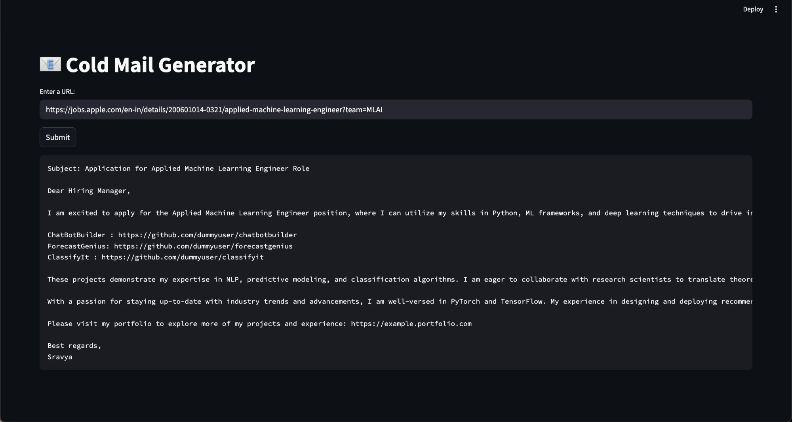

# 📧 RAG-powered Cold Email Generator for Job Applications

End-to-end AI/ML project that automatically generates **personalized cold emails** for job applications. The pipeline includes:

- Job description extraction from careers pages using LangChain + LLaMA (via Groq API)
- Portfolio project retrieval via ChromaDB
- LLM-based email generation with relevant skills and portfolio projects
- Streamlit-based interactive UI for deployment

---

## App Preview



---

## Project Overview

This project demonstrates **end-to-end pipeline engineering**:

1. **Scrape and extract job descriptions** from careers pages.
2. **Retrieve relevant portfolio projects** from a CSV using ChromaDB vector search.
3. **Generate professional cold emails** automatically highlighting your skills, experience, and top projects.

All components are modular, making it easy to adapt for any portfolio or job posting.

---

## Key Highlights

| Component                   | Description                                                                             |
| --------------------------- | --------------------------------------------------------------------------------------- |
| **Job Extraction**          | LangChain + LLaMA (via Groq API) extracts roles, experience, skills, and descriptions.  |
| **Portfolio Storage**       | Projects stored in CSV, indexed with ChromaDB for fast semantic search.                 |
| **Email Generation**        | Personalized emails including top projects, formatted for recruiters.                   |
| **Word Limit**              | Emails restricted to ~200–250 words for readability and conciseness.                    |
| **Clickable Links**         | GitHub and portfolio links are clickable in email output.                               |

---

## Tech Stack

- Python 3.11+  
- Streamlit – Web app interface  
- LangChain & LangChain-Groq – LLM pipelines & prompts  
- ChromaDB – Vector database for portfolio projects  
- pandas – CSV handling  
- python-dotenv – Environment variable management  

---

## Customization

This project is modular and flexible:

- **Swap the LLM:** You can replace the default Llama-3.3-70B model with any other model, such as GPT-OSS 20B, by changing the LLM initialization in `chains.py`.  
- **Change the prompts:** Modify the email or job extraction prompts in `chains.py` to suit different use cases or email styles.  
- **Personalize user details:** Name, portfolio links, and formatting can be customized in the prompts, the `resource/portfolio_projects.csv` file, or in `app.py`.

These options allow you to adapt the pipeline for different portfolios, email styles, or LLMs without changing the core logic.


## Project Structure

```
Cold-Email-Generator/
│
├── app/                       # Main Streamlit app folder
│   ├── main.py                # Streamlit app entry point
│   ├── chains.py              # Job extraction & email generation pipeline
│   ├── portfolio.py           # Portfolio project storage and query via ChromaDB
│   └── utils.py               # Helper functions (e.g., text cleaning)
│
├── resource/
│   └── portfolio_projects.csv  # Sample portfolio projects CSV
│
├── requirements.txt           # Pinned Python dependencies
├── .gitignore                 # Ignored files & folders
└── README.md                  # Project documentation

```

---

## Installation

1. Clone the repository:

```
git clone https://github.com/Sravya-T01/cold-email-generator
cd cold-email-generator

```

2. Create and activate a virtual environment inside your project folder:

```
python -m venv venv
source venv/bin/activate  # macOS/Linux
.\venv\Scripts\activate   # Windows
```

3. Install dependencies:

```
pip install -r requirements.txt
```

4. Add `.env` file in the project root with your API key:

```
GROQ_API_KEY=<your_groq_api_key>
```

---

## Usage

1. Run the Streamlit app:

```
streamlit run app/main.py
```

2. Enter the URL of a job posting from a careers page (e.g., Nike, Apple).  
3. Click **Submit**.  
4. The app will:  
   - Extract job details from the page  
   - Query your portfolio projects based on skills  
   - Generate **personalized cold emails** ready to send  

5. Copy the email — formatting and links are recruiter-ready.

---

## Example Output

**Email for Applied Machine Learning Engineer at Apple**

```
Subject: Application for Applied Machine Learning Engineer Role

Dear Hiring Manager,

I am excited to apply for the Applied Machine Learning Engineer position, where I can utilize my skills in Python, ML frameworks, and deep learning architectures to drive business growth. With a strong background in natural language processing techniques and computer vision algorithms, I am confident in my ability to implement and fine-tune state-of-the-art machine learning models.

PredictiveML : https://github.com/dummyuser/predictiveml
ChatBotBuilder: https://github.com/dummyuser/chatbotbuilder
ForecastGenius: https://github.com/dummyuser/forecastgenius
ClassifyIt: https://github.com/dummyuser/classifyit

These projects demonstrate my expertise in developing predictive models, building conversational AI, forecasting future trends, and classifying data with high accuracy. I am eager to collaborate with research scientists to translate theoretical concepts into practical applications and optimize model performance for production environments.

As a skilled machine learning engineer, I am well-versed in optimizing model performance for scalability and efficiency. I am excited about the opportunity to contribute to the development of innovative machine learning solutions and drive business success.

Please visit my portfolio to explore more about my experience and skills: https://example.portfolio.com

Best regards,
Sravya
```

---

## Key Learnings

- End-to-end **pipeline creation** with LangChain, ChromaDB, and Streamlit.  
- Handling **relevance vs duplicates** when querying portfolio projects.  
- Prompt engineering for **concise, recruiter-ready emails**.  
- Managing dependencies with **virtual environments and pinned versions** to ensure reproducibility.  

---

## Future Improvements

- Add **customizable user inputs** (name, portfolio link, email style).  
- Multi-language support for job descriptions.  
- Deploy on cloud platforms for public access.  
- Allow users to select the LLM model from a dropdown menu (e.g., LLaMA, GPT OSS 20B) in the Streamlit app for flexible email generation.


---

## Portfolio

[Explore my full portfolio](https://www.datascienceportfol.io/SravyaTirumalasetty)
